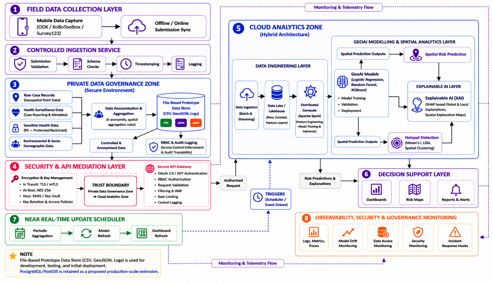
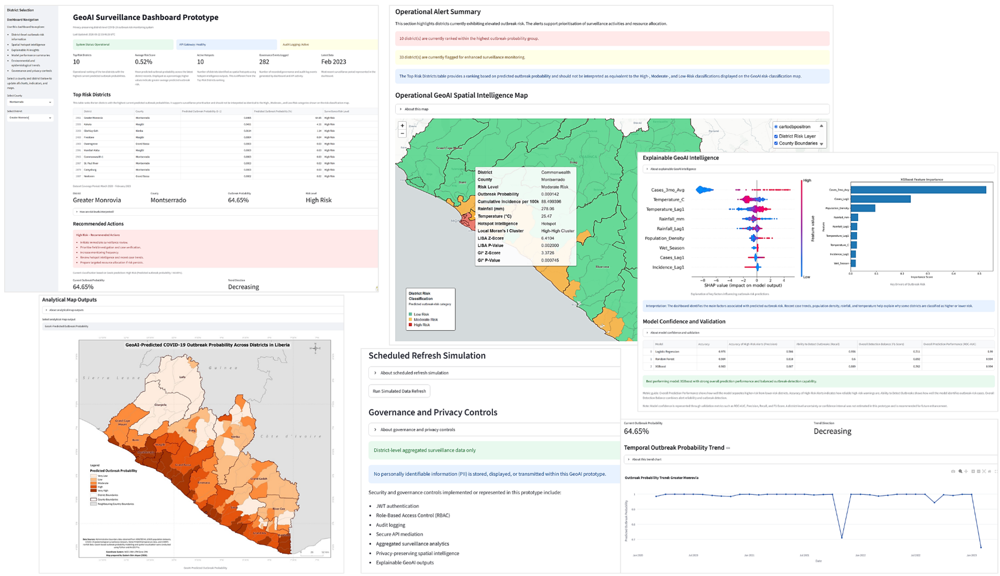
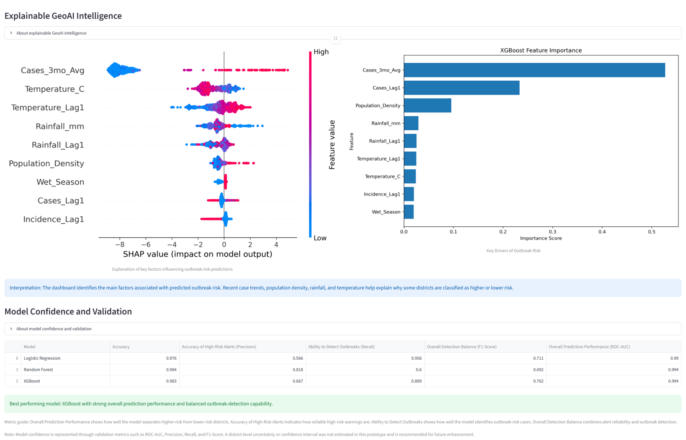
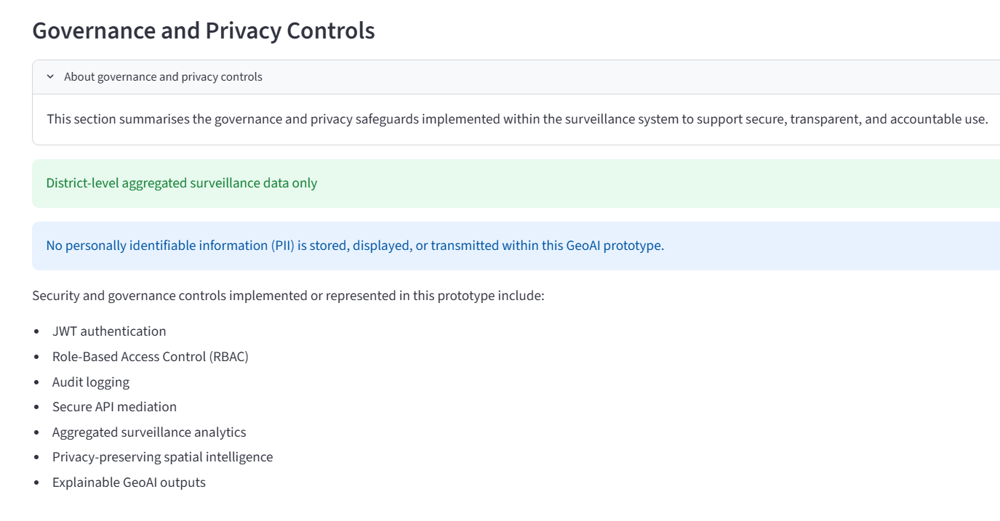
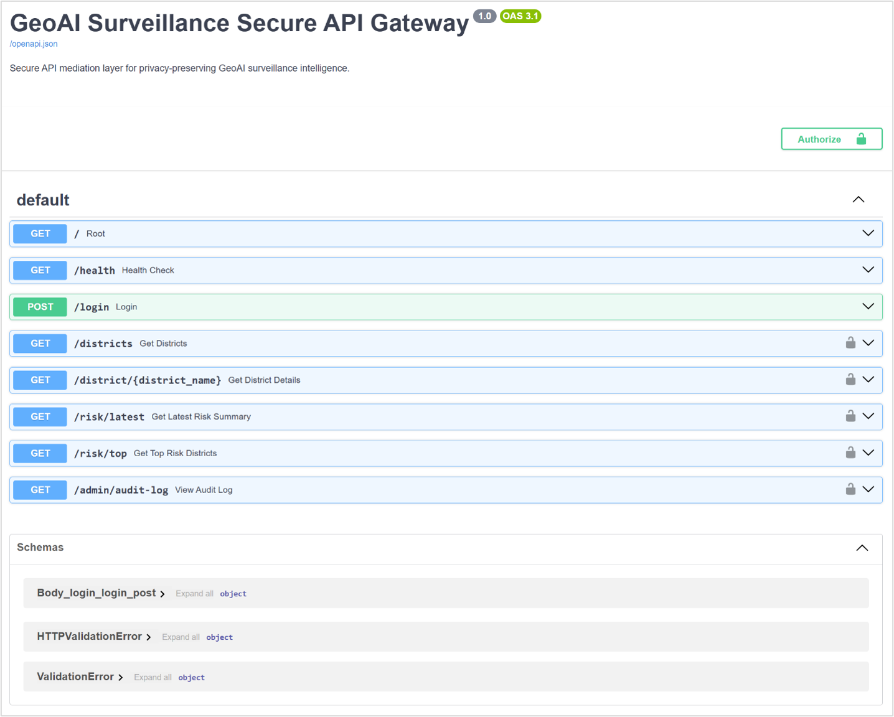

# GeoAI Health Surveillance System

Privacy-preserving GeoAI health surveillance prototype integrating geospatial intelligence, machine learning, explainable artificial intelligence, secure API mediation, dashboard-based decision support, and governance-aware hybrid cloud architecture for district-level outbreak-risk monitoring.

---

## Dissertation Information

**Title:**  
Design and Evaluation of a Privacy-Preserving GeoAI Health Surveillance System Using a Hybrid Cloud Architecture

**Programme:**  
MSc Big Data Technologies

**Institution:**  
University of East London (UEL) / UNICAF

**Year:**  
2026

**Author:**  
Godwin Etim Akpan

**Supervisor:**  
Dr Eya Nnabuike Nnaemeka

---

## Overview

This repository contains the proof-of-concept artefact developed as part of an MSc dissertation on privacy-preserving GeoAI health surveillance.

The system demonstrates how aggregated district-level surveillance data can be transformed into spatial intelligence, outbreak-risk classification outputs, explainable AI artefacts, governance evidence, and dashboard-based decision-support capabilities.

The prototype integrates:

- GeoAI outbreak-risk prediction
- Spatial hotspot and cluster analysis
- SHAP-based explainable AI
- Interactive GIS dashboarding
- Secure FastAPI gateway
- JWT authentication
- Role-based access control
- Audit logging
- Docker-based deployment workflow

---

## Live Demonstration

**Dashboard:**  
https://geoai-health-surveillance-system-bygrraq7o4uwsfokny3lhg.streamlit.app/

**Secure API Documentation:**  
http://18.217.5.170:8000/docs#/

**GitHub Repository:**  
https://github.com/Jedidiah82/GeoAI-Health-Surveillance-System

> Note: The API endpoint is provided as a prototype demonstration using HTTP. A production deployment would require HTTPS enforcement, secure credential management, infrastructure hardening, monitoring, and institutional governance approval.

---

## Academic Disclaimer

This system is a research prototype developed for academic demonstration as part of an MSc dissertation.

It is not intended for clinical diagnosis, patient management, or operational public-health deployment without additional validation, infrastructure hardening, security testing, governance review, and institutional approval.

No personally identifiable information is stored or exposed within the prototype. The artefact uses aggregated and de-identified district-level surveillance outputs.

---

## Core Features

### Operational GeoAI Dashboard

- Interactive Streamlit dashboard
- District-level outbreak-risk monitoring
- Outbreak probability visualisation
- Low, Moderate, and High risk classification
- Top Risk Districts ranking
- KPI intelligence cards
- Temporal trend monitoring
- Environmental and epidemiological indicators

### Spatial Intelligence

- Interactive Folium GIS mapping
- GeoAI outbreak-probability mapping
- GeoAI risk-classification mapping
- Getis-Ord Gi* hotspot analysis
- Local Moran's I cluster and outlier analysis
- District-level spatial surveillance intelligence

### Explainable GeoAI

- SHAP summary plots
- Feature-importance outputs
- XGBoost model interpretation
- Risk-driver explanation
- Explainability support for transparent decision-making

### Governance and Security

- JWT authentication
- Role-based access control
- Secure FastAPI gateway
- Protected API endpoints
- Operational audit logging
- Governance traceability evidence
- Aggregated district-level surveillance intelligence only

### Deployment and Packaging

- Dockerized application architecture
- Docker Compose orchestration
- Streamlit dashboard service
- FastAPI secure API gateway
- GitHub-based version control
- Cloud-deployment demonstration support

---

## System Architecture

The prototype follows a governance-aware hybrid GeoAI architecture that connects field data capture, controlled data ingestion, privacy-preserving data governance, secure API mediation, cloud-based GeoAI analytics, explainability, decision support, scheduled refresh, and governance monitoring.

The architecture consists of the following layers:

1. Field data collection layer
2. Controlled ingestion service
3. Private data governance zone
4. Security and API mediation layer
5. Cloud analytics zone
6. GeoAI modelling and spatial analytics layer
7. Explainable AI layer
8. Decision-support layer
9. Near real-time update scheduler
10. Observability, security, and governance monitoring layer



---

## Dashboard Preview

### Main Dashboard



### GeoAI Outbreak Probability Map


### GeoAI Risk Classification Map


### Hotspot Intelligence


### Explainability and Model Validation Interface



### Governance Monitoring



### Secure API Gateway



---

## Dataset

The prototype uses aggregated district-level COVID-19 surveillance data for Liberia, combined with demographic and environmental variables.

The analytical dataset includes:

- Confirmed cases
- Suspected cases
- Recoveries
- Mortality indicators
- Population indicators
- Temperature variables
- Rainfall variables
- Lagged epidemiological indicators
- Spatially derived indicators

All surveillance data used in the prototype were aggregated and de-identified before analysis. The system is designed to support privacy-preserving district-level surveillance intelligence rather than individual-level monitoring.

---

## Evaluation Summary

The artefact was evaluated across multiple dimensions:

- Predictive performance and outbreak-risk classification
- Spatial intelligence and spatial validity
- Explainability
- Governance controls
- API security
- Decision-support utility

Key evaluation findings include:

- XGBoost achieved the strongest overall balance across outbreak-risk classification metrics among the evaluated models.
- Spatial clustering and hotspot patterns were identified using Global Moran's I, Local Moran's I, and Getis-Ord Gi* analysis.
- SHAP explainability outputs identified plausible epidemiological, demographic, environmental, and spatial drivers of outbreak-risk predictions.
- Governance validation demonstrated authentication, role-based access control, protected API access, secure API mediation, and audit logging.
- Usability-oriented evaluation produced positive ratings across usability, explainability, governance visibility, confidence in analytical outputs, and overall usefulness.

---

## Technology Stack

### GIS and Spatial Analytics

- ArcGIS Pro
- GeoPandas
- Folium
- Shapely
- PySAL

### Machine Learning and Explainability

- Scikit-learn
- XGBoost
- SHAP
- Pandas
- NumPy

### Dashboard and API

- Streamlit
- FastAPI
- Uvicorn
- Plotly
- Streamlit-Folium

### Security and Governance

- JWT authentication
- OAuth2PasswordBearer
- Role-based access control
- Audit logging

### Data Storage and Geospatial Database

- File-based prototype data store using CSV and GeoJSON
- PostgreSQL/PostGIS proposed as the production-scale geospatial database extension
- pgAdmin used for database inspection and management during development

### Deployment

- Docker
- Docker Compose
- GitHub
- Streamlit Cloud
- AWS EC2 prototype API deployment

---

## Repository Structure

```text
GeoAI-Health-Surveillance-System/
|
|-- app/
|   |-- api.py
|   |-- auth.py
|   |-- dashboard.py
|   |-- map_utils.py
|   |-- audit_logger.py
|   |-- refresh_simulator.py
|   |-- data_governance.py
|   |-- model_engine.py
|   |-- __init__.py
|
|-- data/
|   |-- covid_hotspots.geojson
|   |-- covid_local_morans.geojson
|   |-- district_summary.csv
|   |-- final_geoai_model_comparison.csv
|   |-- geoai_spatial_intelligence.geojson
|   |-- geoai_surveillance_outputs.csv
|   |-- lbr_admin1.geojson
|   |-- lbr_admin2.geojson
|
|-- figures/
|   |-- system_architecture.png
|   |-- dashboard_main.png
|   |-- outbreak_probability_map.png
|   |-- risk_map.png
|   |-- hotspot_intelligence.png
|   |-- shap_panel.png
|   |-- governance_panel.png
|   |-- api_gateway.png
|   |-- maps/
|   |-- shap/
|
|-- models/
|   |-- xgb_model.pkl
|
|-- Dockerfile
|-- docker-compose.yml
|-- requirements.txt
|-- README.md
```

---

Note: `data_governance.py` and `model_engine.py` are retained as placeholder modules for future extension of governance and model-serving functionality.

---

## Installation

Clone the repository:

```bash
git clone https://github.com/Jedidiah82/GeoAI-Health-Surveillance-System.git
cd GeoAI-Health-Surveillance-System
```

Create and activate a virtual environment:

```bash
python -m venv venv
```

On Windows:

```bash
venv\Scripts\activate
```

On macOS/Linux:

```bash
source venv/bin/activate
```

Install dependencies:

```bash
pip install -r requirements.txt
```

---

## Running the Streamlit Dashboard

```bash
streamlit run app/dashboard.py
```

The dashboard will be available at:

```text
http://localhost:8501
```

---

## Running the FastAPI Secure Gateway

```bash
uvicorn app.api:app --reload
```

The API will be available at:

```text
http://127.0.0.1:8000
```

Swagger/OpenAPI documentation will be available at:

```text
http://127.0.0.1:8000/docs
```

---

## Prototype Authentication and Access Control

The prototype implements JWT-based authentication with Role-Based Access Control (RBAC) to demonstrate secure access to protected API endpoints and dashboard functionality. This supports the dissertation’s emphasis on privacy-aware, governance-conscious, and controlled access to health surveillance functionality.

For security reasons, demonstration credentials, JWT secrets, and environment-specific configuration values are not included in this public repository. The repository documents the authentication structure and supported user roles without exposing reusable credentials.

### Supported Prototype Roles

#### Analyst Role

**Role:** `analyst`

**Permissions:**

- View the surveillance dashboard
- Access authorised API endpoints
- View outbreak-risk predictions
- Review geospatial and epidemiological outputs

#### Administrator Role

**Role:** `admin`

**Permissions:**

- Full dashboard access
- Administrative API access
- User and system management functions
- Audit log access
- Configuration and governance-related controls

### Environment Configuration

To run the prototype locally or in a controlled deployment environment, create a `.env` file using the provided `.env.example` template. The `.env` file should contain the required credentials, JWT secret, token settings, and application-specific configuration values.

A sample `.env.example` file is provided below:

```env
JWT_SECRET=your_jwt_secret_here
JWT_ALGORITHM=HS256
ACCESS_TOKEN_EXPIRE_MINUTES=60

ADMIN_USERNAME=your_admin_username
ADMIN_PASSWORD=your_admin_password

ANALYST_USERNAME=your_analyst_username
ANALYST_PASSWORD=your_analyst_password
```

The actual `.env` file must not be committed to version control. It should be listed in `.gitignore` to ensure that real credentials and secrets remain private.

```gitignore
.env
```

### Security Note

This repository is intended to demonstrate the prototype architecture, authentication workflow, role-based access structure, and implementation logic developed for the dissertation. It does not publish live credentials, production secrets, or restricted operational configuration. Any deployment beyond local demonstration should use institutionally approved credential management, HTTPS enforcement, secure password hashing, audit controls, and appropriate data governance procedures.

---

## Docker Deployment

Build the Docker image:

```bash
docker build -t geoai-surveillance-system .
```

Run the dashboard container:

```bash
docker run -p 8501:8501 geoai-surveillance-system
```

Dashboard URL:

```text
http://localhost:8501
```

---

## Docker Compose Deployment

Run the full prototype stack:

```bash
docker-compose up --build
```

This launches:

- Streamlit operational dashboard
- FastAPI secure gateway

Dashboard URL:

```text
http://localhost:8501
```

API URL:

```text
http://localhost:8000
```

API documentation:

```text
http://localhost:8000/docs
```

---

## API Endpoints

The FastAPI gateway provides protected access to district-level surveillance intelligence.

Common endpoints include:

```text
GET  /
GET  /health
POST /login
GET  /districts
GET  /district/{district_name}
GET  /risk/latest
GET  /risk/top
GET  /admin/audit-log
```

Access to protected endpoints requires authentication. The `/admin/audit-log` endpoint requires administrator access.

---

## Security and Governance Features

The platform demonstrates:

- Secure API mediation
- JWT-based authentication
- Role-based access control
- Protected API endpoints
- Operational audit logging
- Governance traceability
- Privacy-preserving district-level surveillance intelligence

The governance mechanisms are implemented as proof-of-concept controls and are intended to demonstrate architectural feasibility rather than production security maturity.

---

## Explainable AI Features

The system integrates SHAP explainability to:

- Identify major outbreak-risk drivers
- Support model transparency
- Improve operational interpretability
- Strengthen trustworthiness and accountability
- Connect predictive outputs with public-health reasoning

---

## Operational Intelligence Features

The dashboard supports:

- Outbreak probability prediction
- District-level risk classification
- Top Risk Districts ranking
- Hotspot intelligence
- Operational alert summaries
- Environmental surveillance indicators
- Model validation outputs
- Explainability outputs
- Governance monitoring

---

## Research Context

This repository supports MSc dissertation research in:

- GeoAI
- Spatial epidemiology
- Explainable AI
- Hybrid cloud architecture
- Public-health informatics
- Governance-aware AI systems
- Privacy-preserving spatial analytics
- Decision-support systems

---

## Citation

If referencing this repository, please cite:

Akpan, G. E. (2026). *Design and Evaluation of a Privacy-Preserving GeoAI Health Surveillance System Using a Hybrid Cloud Architecture*. MSc Big Data Technologies Dissertation, University of East London / UNICAF.

---

## Author

Godwin Etim Akpan  
Geospatial Data Analyst | GeoAI Researcher | MSc Big Data Technologies Candidate

GitHub:  
https://github.com/Jedidiah82

---

## License and Academic Use

This repository is intended for academic research, demonstration, and educational purposes.

Use of the code, data, or outputs should acknowledge the academic context of the dissertation and should not be interpreted as an operational public-health surveillance deployment.
